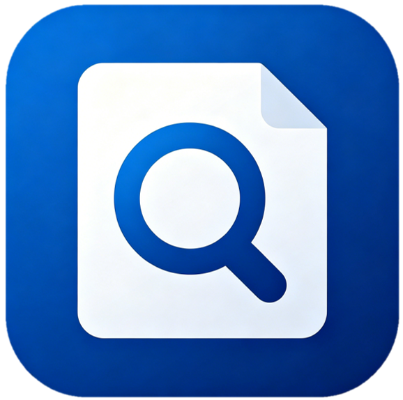
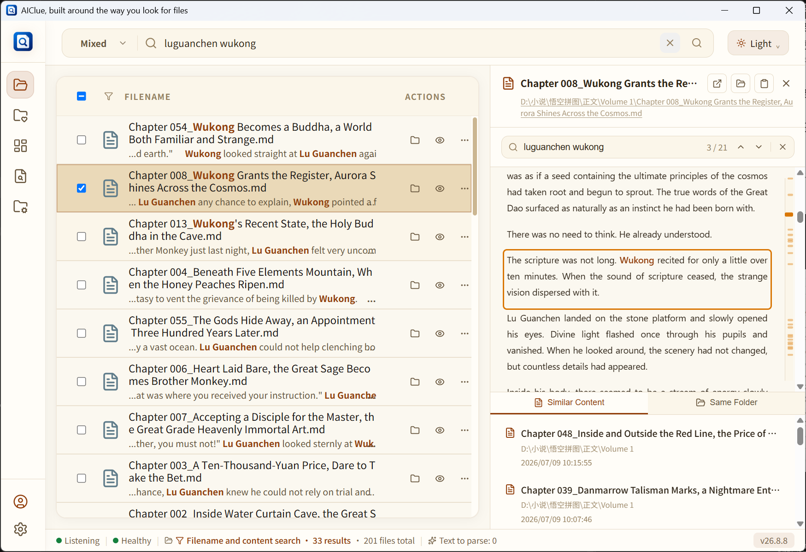

  
  <h1>AIClue</h1>
  
<strong>Search the files on your computer like searching the web.</strong>

  

    <a href="readme.md">简体中文</a>
  

  

    <a href="https://aiclue.boxai365.com/en/download/?utm_source=github&amp;utm_medium=referral&amp;utm_campaign=aiclue_repository"><strong>Download AIClue</strong></a>
    ·
    <a href="https://aiclue.boxai365.com/en/?utm_source=github&amp;utm_medium=referral&amp;utm_campaign=aiclue_repository">Official website</a>
    ·
    <a href="https://aiclue.boxai365.com/en/docs/?utm_source=github&amp;utm_medium=referral&amp;utm_campaign=aiclue_repository">User manual</a>
  

AIClue is a local file finding and organizing tool for Windows. You do not need the full filename or a folder-by-folder search. Type the few words you remember to search filenames, folder locations, and common document content together, then use highlighted matches, content snippets, and previews to identify the file you need.

Currently published features are free to use, and basic features work without registration. File scanning, search, and organization are completed on your computer by default.

## Why AIClue

| Capability | What it helps you do |
| --- | --- |
| **Search filenames and content** | Search filenames, folder locations, and common document content with a few remembered words, with highlighted matches and content snippets. |
| **Filter and preview** | Narrow results by file type, time, and directory; preview common documents, spreadsheets, presentations, images, audio/video, Markdown, code, and plain text before opening. |
| **Follow related material** | Continue from one close result to files in the same folder or files with similar content. |
| **Project workspaces** | Collect files from different directories in one workspace without copying or moving the originals. |
| **Incoming-file organization** | Review locations that accumulate files, such as Desktop, Downloads, or chat folders, then confirm moves or archiving. |
| **Duplicate detection** | Find files with identical content, review them in groups, and move selected extra copies to the system recycle bin. |

## Local-first, with you in control

- Only folders you explicitly add are scanned.
- Everyday file scanning, content reading, search, filtering, and preview are mainly completed on your device.
- Original files are not uploaded by default, and local search or preview does not automatically upload file content.
- Source files are not automatically moved, renamed, or deleted in the background; organization and cleanup actions require confirmation.
- Account login, entitlement synchronization, and software updates require network access.
- Redacted and scope-limited diagnostic material is uploaded only when you actively submit feedback and select the diagnostic-data option.

Read the full [AIClue Privacy Policy](https://aiclue.boxai365.com/en/privacy/?utm_source=github&utm_medium=referral&utm_campaign=aiclue_repository).

## Download and install

Get the current Windows installer from the [official AIClue download page](https://aiclue.boxai365.com/en/download/?utm_source=github&utm_medium=referral&utm_campaign=aiclue_repository). You can also download the installer whose name ends in `-setup.exe` from this repository's [Releases](https://github.com/Tiller-Mu/aiclue/releases/latest) page.

> The `Source code (zip)` and `Source code (tar.gz)` archives automatically shown by GitHub are not AIClue installers and do not contain the application source code.

### System requirements

| Item | Minimum | Recommended |
| --- | --- | --- |
| Windows | Windows 10 64-bit, 4GB RAM | Windows 10/11 64-bit, 8GB+ RAM |
| Disk | 500MB free space for the app and search data | 1GB+ free space |
| Network | Required for downloads, automatic updates, account login, and entitlement synchronization | Everyday scanning, search, and preview can be used offline |

When you add many files for the first time, AIClue needs time to read file information and prepare local search data. Everyday search and browsing become smoother after this initial preparation finishes.

## Learn more

- [Official website](https://aiclue.boxai365.com/en/?utm_source=github&utm_medium=referral&utm_campaign=aiclue_repository)
- [Download AIClue](https://aiclue.boxai365.com/en/download/?utm_source=github&utm_medium=referral&utm_campaign=aiclue_repository)
- [User manual](https://aiclue.boxai365.com/en/docs/?utm_source=github&utm_medium=referral&utm_campaign=aiclue_repository)
- [Changelog](https://aiclue.boxai365.com/en/changelog/?utm_source=github&utm_medium=referral&utm_campaign=aiclue_repository)
- [Privacy Policy](https://aiclue.boxai365.com/en/privacy/?utm_source=github&utm_medium=referral&utm_campaign=aiclue_repository)

## About this repository

This is AIClue's public release repository. It provides verified Windows installers, release manifests, and signature files. It does not contain the AIClue application source code.

To report a problem or share a suggestion, use the feedback form in AIClue's Account Center or email [aiclue@boxai365.com](mailto:aiclue@boxai365.com).
