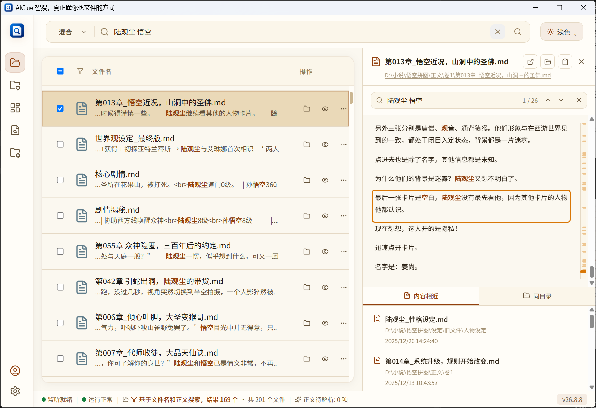

  
  <h1>AIClue 智搜</h1>
  
<strong>像搜网页一样，找电脑里的文件。</strong>

  

    <a href="README.en.md">English</a>
  

  

    <a href="https://aiclue.boxai365.com/zh/download/?utm_source=github&amp;utm_medium=referral&amp;utm_campaign=aiclue_repository"><strong>下载 AIClue</strong></a>
    ·
    <a href="https://aiclue.boxai365.com/zh/?utm_source=github&amp;utm_medium=referral&amp;utm_campaign=aiclue_repository">官方网站</a>
    ·
    <a href="https://aiclue.boxai365.com/zh/docs/?utm_source=github&amp;utm_medium=referral&amp;utm_campaign=aiclue_repository">用户说明书</a>
  

AIClue 是一款面向 Windows 的本地文件查找和整理工具。文件名记不全，也不用一个文件夹一个文件夹翻：输入你还记得的几个字，就能从文件名、文件夹位置和常见文档内容中一起查找，并通过命中高亮、内容片段和预览判断哪个才是目标文件。

当前已发布功能可免费使用，基础功能无需注册即可开始使用。文件扫描、搜索和整理默认在你的电脑上完成。

## 为什么使用 AIClue

| 能力 | 可以帮你做什么 |
| --- | --- |
| **搜索文件名和正文** | 用记得的几个字搜索文件名、文件夹位置和常见文档内容，并查看命中高亮和内容片段。 |
| **筛选与预览** | 按文件类型、时间和目录缩小结果；在打开前预览常见文档、表格、演示文稿、图片、音视频、Markdown、代码和纯文本。 |
| **继续寻找相关资料** | 从一个接近的结果继续查看同目录文件或内容相近文件，把散落的资料串联起来。 |
| **项目工作区** | 把不同目录里的文件加入同一个工作区集中查看，不复制、不移动源文件。 |
| **待整理文件** | 集中查看桌面、下载或聊天文件等容易堆积的位置，确认后再移动或归档。 |
| **重复文件检测** | 找出内容完全一致的文件，分组确认后再将多余副本移入系统回收站。 |

## 本地优先，操作由你确认

- 只扫描你明确添加的文件夹。
- 日常文件扫描、正文读取、搜索、筛选和预览主要在本机完成。
- 默认不上传原始文件，也不因为本地搜索或预览而自动上传文件内容。
- 不会在后台自动移动、改名或删除源文件；整理和清理操作需要你确认。
- 账号登录、权益同步、软件更新等功能需要联网。
- 仅在你主动提交反馈并勾选“同步上传分析数据”时，才会上传经过脱敏和范围限制的诊断材料。

完整说明请阅读 [AIClue 隐私政策](https://aiclue.boxai365.com/zh/privacy/?utm_source=github&utm_medium=referral&utm_campaign=aiclue_repository)。

## 下载与安装

请从 [AIClue 官方下载页面](https://aiclue.boxai365.com/zh/download/?utm_source=github&utm_medium=referral&utm_campaign=aiclue_repository) 获取当前 Windows 安装程序。也可以在本仓库的 [Releases](https://github.com/Tiller-Mu/aiclue/releases/latest) 页面下载名称以 `-setup.exe` 结尾的安装包。

> GitHub 自动显示的 `Source code (zip)` 和 `Source code (tar.gz)` 不是 AIClue 安装程序，也不包含应用源代码。

### 系统要求

| 项目 | 最低配置 | 推荐配置 |
| --- | --- | --- |
| Windows | Windows 10 64 位，4GB 内存 | Windows 10/11 64 位，8GB 以上内存 |
| 磁盘 | 500MB 可用空间（应用和搜索数据） | 1GB 以上可用空间 |
| 网络 | 下载、自动更新、账号登录和权益同步时需要 | 日常扫描、搜索和预览可离线使用 |

首次添加大量文件时，AIClue 需要一些时间读取文件信息并准备本地搜索数据；完成后，日常搜索和浏览会更加流畅。

## 了解更多

- [官方网站](https://aiclue.boxai365.com/zh/?utm_source=github&utm_medium=referral&utm_campaign=aiclue_repository)
- [下载 AIClue](https://aiclue.boxai365.com/zh/download/?utm_source=github&utm_medium=referral&utm_campaign=aiclue_repository)
- [用户说明书](https://aiclue.boxai365.com/zh/docs/?utm_source=github&utm_medium=referral&utm_campaign=aiclue_repository)
- [更新记录](https://aiclue.boxai365.com/zh/changelog/?utm_source=github&utm_medium=referral&utm_campaign=aiclue_repository)
- [隐私政策](https://aiclue.boxai365.com/zh/privacy/?utm_source=github&utm_medium=referral&utm_campaign=aiclue_repository)

## 关于本仓库

本仓库是 AIClue 的公开发布仓库，用于提供经过验证的 Windows 安装包、发布清单和签名文件，不包含 AIClue 应用源代码。

如果你在使用中遇到问题或有建议，可以在 AIClue 的账号中心提交反馈，或发送邮件至 [aiclue@boxai365.com](mailto:aiclue@boxai365.com)。
